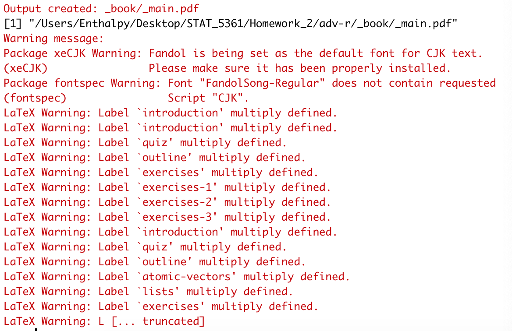

```{r setup, include=FALSE}
knitr::opts_chunk$set(echo = TRUE)
```

# Computing Enviornment
1. System: MacOS
2. Programming Tool: R/Rstudio
3. Other tools: MacTex

# Compiling Codes
```{}
devtools::install_github("hadley/sloop")  
devtools::install_github("hadley/emo")  
bookdown::render_book("index.Rmd", output_format = "bookdown::pdf_book")
```


# Problems and solutions
## Problem 1: Lacking of packages
### Description
1. Error in loadNamespace(name) : there is no package called `bookdown`.  
2. Error in Rscript_render(f, render_args, render_meta, add1, add2): Failed to compile 'Introduction.Rmd'.  
3. Error in Rscript_render(f, render_args, render_meta, add1, add2) : Failed to compile 'Names-values.Rmd'.  
4. Error in Rscript_render(f, render_args, render_meta, add1, add2): Failed to compile 'R6.Rmd'.  
Error in Rscript_render(f, render_args, render_meta, add1, add2): Failed to compile 'OO-tradeoffs.Rmd'.  
5. Quitting from lines 233-234 (Perf-measure.Rmd). Error: `ggplot2` and `tidyr` must be installed to use `autoplot`.  
6. Quitting from lines 233-234 (Perf-measure.Rmd). Error: `ggbeeswarm` must be installed to use `type = "beeswarm"` option.  

### Solution
I Downloaded packages named `bookdown`, `dplyr`, `lobstr`, `RSQLite`, `zeallot`, `bench`, `profvis`, `ggplot2`, `tidyr` and `ggbeeswarm`.

## Problem 2: Packages too old.
### Description
Quitting from lines 209-221 (Big-picture.Rmd).  
Error: The dbplyr package is required to communicate with database backends.  

### Solution
According to package `dplyr`'s documentation, as of dplyr 0.6.0, a number of database and SQL functions were moved from `dplyr` to `dbplyr`. Thus, I installed the package `dbplyr` instead and then the problem solved.

## Problem 3: Lacking of `XQuartz` in my Mac
### Description
Error in dev.control(displaylist = if (record) "enable" else "inhibit"): dev.control() called without an open graphics device

### Solution
To solve this problem in MacOS, one should install `XQuartz`. If you have `Homebrew` installed in your Mac, run the code
```{}
brew cask install xquartz
```
in the Terminal. If not, one may run the code
```{}
/bin/bash -c "$(curl -fsSL https://raw.githubusercontent.com/Homebrew/install/master/install.sh)"
```
in the Terminal to install `Homebrew` first.

## Problem 4: Lacking of fonts.
### Description
1. ! Package fontspec Error: The font "Inconsolata" cannot be found.  
2. ! Package fontspec Error: The font "Andale-Mono" cannot be found.  

### Solution
I downloaded the font "Inconsolata" from `https://fonts.google.com/specimen/Inconsolataand` and "Andale-Mono" from `https://www.cufonfonts.com/font/andale-mono` and installed them to my Mac.

## Problem 5: Environment not found.
### Description
Environment sidebar undefined.  

### Solution
I updated rmarkdown from github instead of cran using code
```{}
remotes::install_github('rstudio/rmarkdown')
```
and the problem solved.  

# Result
Finally, the book named '_main.pdf' was successfully compiled but there were still some warnings shown in the log.
```{r pressure, echo=FALSE, fig.cap="Warnings", out.width = '100%'}

```


